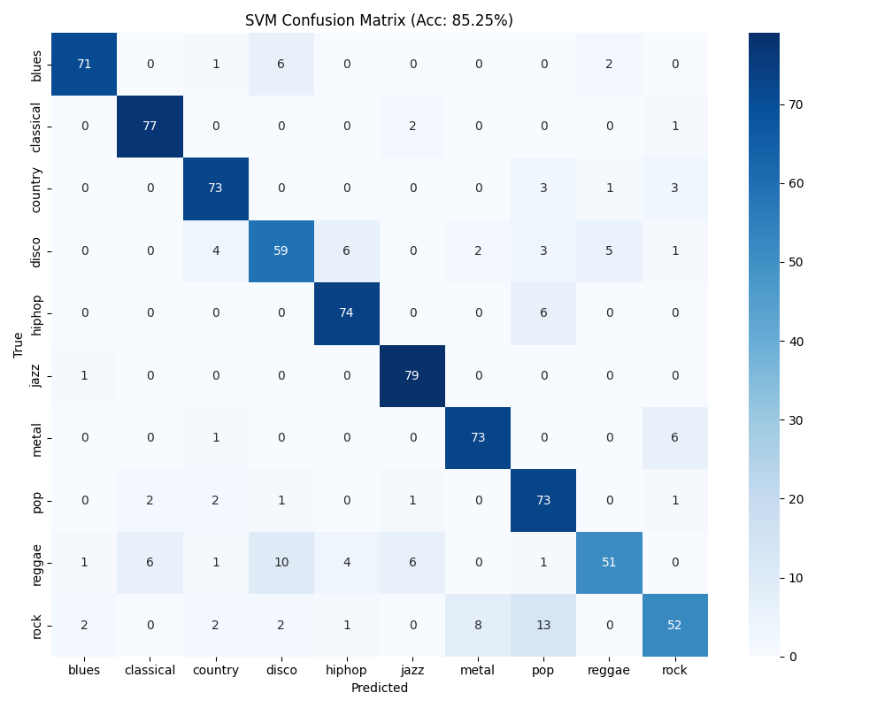

# GTZAN Audio Genre Classifier

A production-ready audio classification pipeline designed to identify
music genres using the **GTZAN dataset**.\
This project leverages **HuggingFace Transformers (MERT)** for
high-quality audio embeddings and **Scikit-Learn (SVM)** for efficient
and robust classification.

------------------------------------------------------------------------

## Key Features

-   **Transformer Embeddings:** Uses
    [MERT-v1-95M](https://huggingface.co/m-a-p/MERT-v1-95M) for
    extracting rich audio representations.
-   **Smart Preprocessing:** Automatic audio chunking, overlapping
    windows, and padding.
-   **Robust Classification Pipeline:** Scaling → PCA → SVM.
-   **Modern Tooling:** Built with `uv` + `hatchling` and fully
    configurable via `pyproject.toml`.

------------------------------------------------------------------------

## Installation

Requires **Python 3.10+**

``` bash

pip install uv
uv venv .venv
source .venv/bin/activate        # Linux/macOS
.\.venv\Scripts\activate       # Windows
uv pip install -e .
```

------------------------------------------------------------------------

## Usage

All CLI tools are installed automatically when running
`pip install -e .`.

------------------------------------------------------------------------

### **1. Feature Extraction**

Extracts MERT embeddings from the dataset and stores them on disk.

``` bash
audio-extract
```

------------------------------------------------------------------------

### **2. Model Training**

Runs GridSearchCV over SVM hyperparameters and saves the best-performing
model.

``` bash
audio-train
```

You can modify the hyperparameter search space in:

    src/svm_config.json

------------------------------------------------------------------------

### **3. Model Inference**

Predict the genre of a single audio file:

``` bash
audio-inference --path "path/to/your/song.wav"
```

------------------------------------------------------------------------

------------------------------------------------------------------------

## Alternative Commands (if CLI scripts do not work)

If the main CLI scripts (`audio-extract`, `audio-train`, `audio-inference`) do not work, you can run the modules directly using `uv`:

```
bash
# Feature extraction
uv run python -m audio_classifier.feature_extraction

# Model training
uv run python -m audio_classifier.train

# Model inference
uv run python -m audio_classifier.inference
```

------------------------------------------------------------------------
## Results

The SVM classifier was evaluated on the extracted MERT embeddings across all 10 GTZAN genres.

Below is the confusion matrix generated during evaluation:



------------------------------------------------------------------------
## License

This project is released under the MIT License.\
GTZAN dataset must be downloaded separately and is subject to its
original license.
